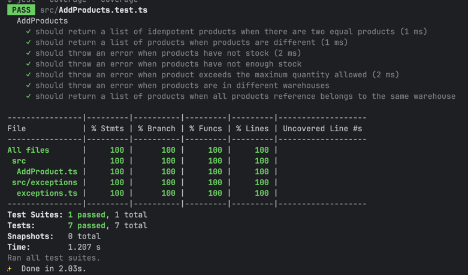

# nerdeala-workshop-tdd
Workshop para Nerdeala de TDD más IA 


# Funcionalidad a implementar

Como usuario, quiero añadir productos que cumplan con los siguientes criterios

- Los productos a añadir deben ser idempotentes
- Sólo se puede añadir productos que no superen su stock
- Sólo se pueden añadir hasta un máximo por producto
- Sólo se puede añadir productos de depósitos relacionados


# Alcance
Se deberá implementar un servicio/interactor que retorne una lista de productos válidados 
_(que cumplan con los criterios)_ en base a su referencia y cantidad. 

Los productos deben ser obtenidos mediante `IProductRepository`. 

Si un producto no cumple con los criterios, se deberá arrojar una excepción.

# Criterios
- Usar las abstracciones ya dispuestas.
- Implementar la funcionalidad con TDD.
- Coverage 100%.
- Clean Code.
- SOLID.

# Abstracciones

```
dto IProductReferenceDTO {
    sku: string;
    quantity: number;
}

dto IRetrieveManyProductsDTO {
    skus: string[];
}

dto IAddProductsDTO {
    products: IProductReferenceDTO[];
}

entity IProduct {
    sku: string;
    name: string;
    price: number;
    stock: number;
    category: string;
    brand: string;
}

interface IProductRepository {
    retrieveMany(dto: IRetrieveManyProductsDTO): Promise<IProduct[]>
}

interactor IAddProducts {
    execute(dto:IAddProductsDTO): Promise<IProduct[]>;
}
```


# Evidencia

